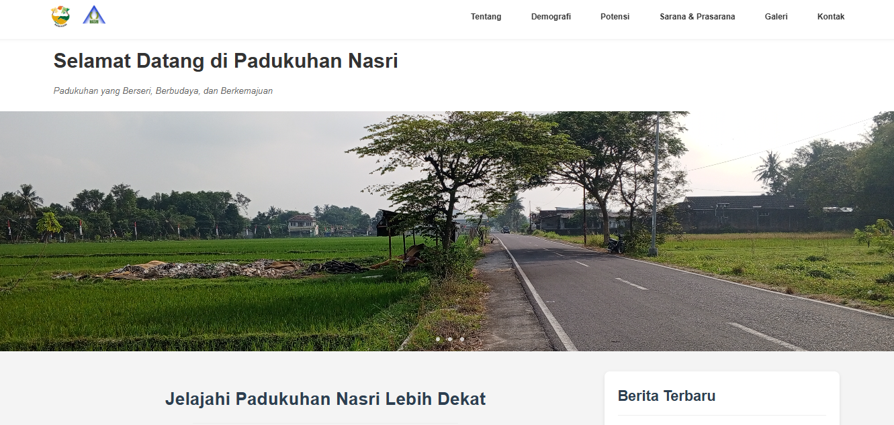

# Nasri Hamlet Profile Website

This is the official repository for the Nasri Hamlet profile website project, developed as part of the Community Service Program (KKN) Batch 117 by students of UIN Sunan Kalijaga Yogyakarta.



---

### **Description**

This website aims to digitize and publish information about Nasri Hamlet, located in Sumbersari, Moyudan, Sleman. It presents geographical data, demographics, local potential, facilities, and documentation of community activities in an accessible format. This project utilizes the Asset-Based Community-driven Development (ABCD) approach to highlight the existing assets and potential within the community.

---

### **Features**

* **Complete Profile:** Comprehensive pages for About, Demographics, Potential, and Facilities.
* **Dynamic News:** A news section with content managed through a Headless CMS (Contentful), complete with an archive page and a "Load More" feature.
* **Photo Gallery:** Visual documentation of community activities and the hamlet's atmosphere.
* **Contact Form:** A functional contact form powered by Formspree.
* **Interactive Map:** An embedded map showing the hamlet's location.
* **Responsive Design:** Optimized viewing experience across various devices, including desktops and mobile phones.

---

### **Tech Stack**

* HTML5
* CSS3 (with Flexbox & Grid)
* Vanilla JavaScript (ES6+)
* **Contentful:** As the Headless CMS to manage news content.
* **Formspree:** To handle submissions from the contact form.
* **Font Awesome:** For iconography.

---

### **Local Setup**

1.  **Clone this repository:**
    ```bash
    git clone [https://github.com/heriswaya/web-padukuhan-nasri.git](https://github.com/heriswaya/web-padukuhan-nasri.git)
    ```
2.  **Create the configuration file:**
    Copy the `js/config.js.example` file and rename it to `js/config.js`.

3.  **Enter API Keys:**
    Open `js/config.js` and fill in the `SPACE_ID` and `ACCESS_TOKEN` variables with your API keys from your Contentful account.

4.  **Open in Browser:**
    Open the `index.html` file directly in your web browser.

---

### **Future Improvements**
*This project has the potential for further development. Some features that could be added in the future include:*
* ***Full Pagination:*** *Replacing the "Load More" button with a numbered pagination system (1, 2, 3, ...) on the news page for better navigation.*
* ***Search Functionality:*** *Adding a search bar on the news page to filter and search for articles by title or keyword.*
* ***Custom 404 Page:*** *Creating a custom-designed "404 Not Found" page to be more user-friendly.*
* ***Accessibility (a11y) Enhancements:*** *Conducting an accessibility audit and implementing improvements to ensure the website is comfortably usable by everyone, including people with disabilities.*
* ***Light/Dark Mode:*** *Adding an option for users to switch between light and dark themes according to their preference.*

---

### **The Team**
This report and project were prepared by the KKN Team of UIN Sunan Kalijaga, Batch 117, Group 193:
1.  Imaduddin Abdur-Rahim (22104070022)
2.  Hastin Setia Prabandari (22106020025)
3.  Saima Hasibuan (22108030014)
4.  Heriswaya (22106010020)
5.  Uswatun Hasanah (22102050003)
6.  Aura Itansis Merita (22102030087)
7.  Muhammad Agil Hadyan Alimi (22105030031)
8.  Nahwa Wahdah Amilatul Haq (22104020041)
9.  Siti Komala Mutiara (22102030013)
10. Faiz Akmal Noor Adha (22107020024)

---

### **Acknowledgements**

We would like to express our gratitude to all parties who supported this KKN program, especially:
* Mrs. Krysna Yudy Nusantari, M.Psi., Psikolog, as the Field Supervisor.
* Mr. Zamzuri Latif, as the Head of Nasri Hamlet.
* All residents of Nasri Hamlet for their participation and support.

---
---
---

# Website Profil Padukuhan Nasri

Ini adalah repositori resmi untuk proyek website profil Padukuhan Nasri, yang dikembangkan sebagai bagian dari program Kuliah Kerja Nyata (KKN) Angkatan 117 oleh mahasiswa Universitas Islam Negeri Sunan Kalijaga Yogyakarta.


---

### **Deskripsi**

Website ini bertujuan untuk mendigitalkan dan mempublikasikan informasi mengenai Padukuhan Nasri, Kalurahan Sumbersari, Moyudan, Sleman. Website ini menyajikan data geografis, demografis, potensi lokal, fasilitas, serta dokumentasi kegiatan masyarakat dalam format yang mudah diakses. Proyek ini menggunakan pendekatan *Asset-Based Community-driven Development* (ABCD) untuk menonjolkan aset dan potensi yang ada di dalam masyarakat.

---

### **Fitur**

* **Profil Lengkap:** Halaman Tentang, Demografi, Potensi, dan Fasilitas.
* **Berita Dinamis:** Bagian berita yang kontennya dikelola melalui Headless CMS (Contentful), lengkap dengan halaman arsip dan fitur "Muat Lebih Banyak".
* **Galeri Foto:** Dokumentasi visual kegiatan dan suasana padukuhan.
* **Formulir Kontak:** Formulir kontak fungsional menggunakan Formspree.
* **Peta Interaktif:** Peta lokasi padukuhan yang disematkan.
* **Desain Responsif:** Tampilan yang optimal di berbagai perangkat, baik desktop maupun mobile.

---

### **Teknologi yang Digunakan**

* HTML5
* CSS3 (dengan Flexbox & Grid)
* Vanilla JavaScript (ES6+)
* **Contentful:** Sebagai Headless CMS untuk mengelola konten berita.
* **Formspree:** Untuk menangani pengiriman pesan dari formulir kontak.
* **Font Awesome:** Untuk ikonografi.

---

### **Cara Menjalankan Proyek Lokal**

1.  **Clone repositori ini:**
    ```bash
    git clone [https://github.com/heriswaya/web-padukuhan-nasri.git](https://github.com/heriswaya/web-padukuhan-nasri.git)
    ```
2.  **Buat file konfigurasi:**
    Salin file `js/config.js.example` dan ubah namanya menjadi `js/config.js`.

3.  **Masukkan Kunci API:**
    Buka `js/config.js` dan isi variabel `SPACE_ID` dan `ACCESS_TOKEN` dengan kunci API dari akun Contentful Anda.

4.  **Buka di Browser:**
    Buka file `index.html` langsung di browser Anda.

---

### **Rencana Pengembangan**

Proyek ini memiliki potensi untuk dikembangkan lebih lanjut. Beberapa fitur yang bisa ditambahkan di masa depan antara lain:
* **Paginasi Penuh:** Mengganti tombol "Muat Lebih Banyak" dengan sistem penomoran halaman (1, 2, 3, ...) di halaman berita untuk navigasi yang lebih baik.
* **Fungsi Pencarian:** Menambahkan bar pencarian di halaman berita untuk memfilter dan mencari artikel berdasarkan judul atau kata kunci.
* **Halaman 404 Kustom:** Membuat halaman "404 Not Found" yang didesain khusus agar lebih ramah pengguna.
* **Peningkatan Aksesibilitas:** Melakukan audit dan perbaikan aksesibilitas (a11y) untuk memastikan website dapat digunakan dengan nyaman oleh semua kalangan, termasuk penyandang disabilitas.
* **Mode Gelap/Terang:** Menambahkan opsi bagi pengguna untuk beralih antara tema terang dan gelap sesuai preferensi.

---

### **Tim Penyusun**
Laporan dan proyek ini disusun oleh Tim KKN UIN Sunan Kalijaga Angkatan 117, Kelompok 193:
1.  Imaduddin Abdur-Rahim (22104070022)
2.  Hastin Setia Prabandari (22106020025)
3.  Saima Hasibuan (22108030014)
4.  Heriswaya (22106010020)
5.  Uswatun Hasanah (22102050003)
6.  Aura Itansis Merita (22102030087)
7.  Muhammad Agil Hadyan Alimi (22105030031)
8.  Nahwa Wahdah Amilatul Haq (22104020041)
9.  Siti Komala Mutiara (22102030013)
10. Faiz Akmal Noor Adha (22107020024)

---

### **Ucapan Terima Kasih**

Terima kasih kami ucapkan kepada semua pihak yang telah mendukung kelancaran program KKN ini, terutama kepada:
* Ibu Krysna Yudy Nusantari, M.Psi., Psikolog, selaku Dosen Pembimbing Lapangan.
* Bapak Zamzuri Latif, selaku Kepala Padukuhan Nasri.
* Seluruh warga masyarakat Padukuhan Nasri atas partisipasi dan dukungannya.
